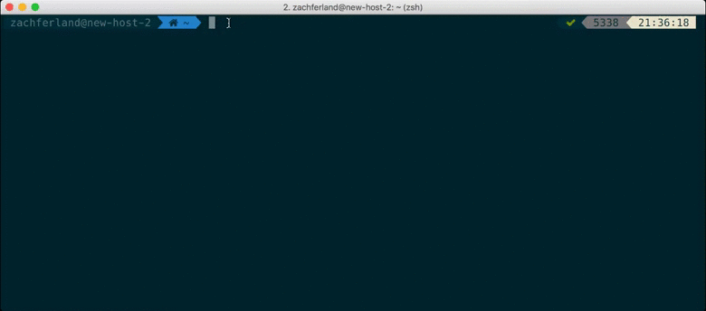

# uPort CLI Client

Create and manage uPort identities from the command line.

## Install

```
$ npm install --global uport-cli-client
```

## Usage


```
$ uport-id --help

Usage: uport-id [options] [command]


Options:

  -h, --help  output usage information


Commands:

  create <name>      Create a new uPort identity with a given name. Name is just a reference and not related to the identity.
  identity [name]    List all identities and see currently selected identity. Optionally pass a name to select another identity.
  consume <uri>      Selected identity consumes given <uri> and processes it. Any changed state will be saved.
  export [fileName]  Selected identity is serialized and written to standard output. Optionally pass a file path/name to have the serialized identity written to the given file
  modify [type]      Modify DDO of an app identity by passing in `appDDO` type or modify config of an app identity by passing `config` type. Only a subset of config values can be changed once an identity is initialized.
```
## Demo


